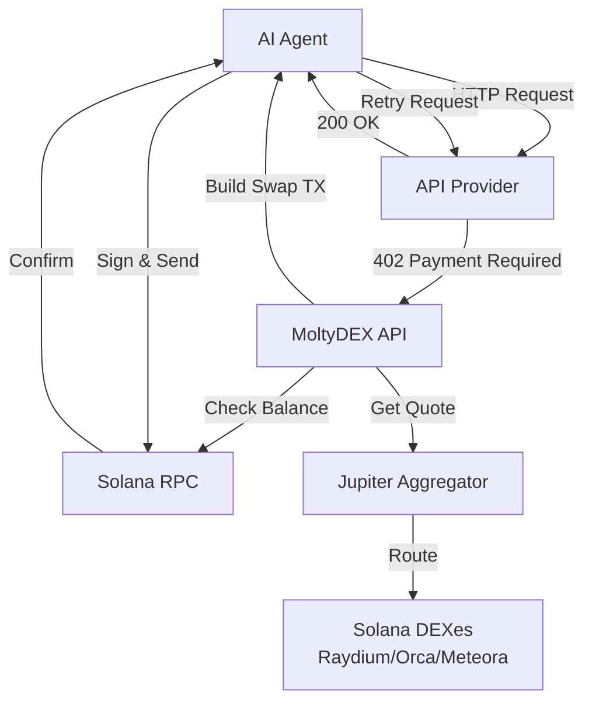

# MoltyDEX — The First DEX Built for x402 Payments

[](https://opensource.org/licenses/MIT)
[](https://nodejs.org/)
[](https://solana.com/)
[](https://x402.dev)
[](./tests/TEST_RESULTS.md)
[](https://api.moltydex.com/api/health)
[](https://github.com/Djtrixuk/moltydex)
[](https://github.com/Djtrixuk/moltydex)

**Automatically swap tokens when making x402 payments. Get the best prices across all Solana DEXes. Built specifically for AI agents and pay-per-use APIs.**

MoltyDEX enables AI agents to automatically handle x402 Payment Required responses by:
- ✅ Detecting payment requirements
- ✅ Checking token balances
- ✅ Swapping tokens automatically (SOL → USDC, or any pair)
- ✅ Making payments seamlessly
- ✅ Retrying original requests

**The Problem:** Agents need to pay for APIs, but often don't have the exact token required. An agent might have SOL, but the API wants USDC. Without automatic swapping, automation breaks.

**The Solution:** MoltyDEX handles everything automatically. Zero manual intervention needed.

**Live Now:** https://www.moltydex.com | **Docs:** https://www.moltydex.com/developers | **X:** [@MoltyDEX](https://x.com/MoltyDEX)

> 💡 **Hackathon Submission:** See [HACKATHON.md](./HACKATHON.md) for complete submission details

**Latest Updates (Feb 2026):**
- ✅ Fixed balance fetching for all tokens (JUP, USDC, etc.)
- ✅ Improved token logo display and preservation
- ✅ Added JUP, POPCAT, BUTTCOIN to popular tokens
- ✅ Wallet token discovery (shows all tokens in wallet)
- ✅ Better error handling and timeout management
- ✅ 0% platform fees - completely free swaps

**Test Status:** ✅ [22 tests passing](tests/TEST_RESULTS.md) | [Run Tests](tests/HOW_TO_RUN_TESTS.md)

**Why aggregator over DEX:**
- ✅ **Zero deployment costs** — No smart contract deployment needed
- ✅ **No liquidity required** — Routes through existing DEXes
- ✅ **Fast to launch** — API wrapper around Jupiter
- ✅ **Revenue potential** — Small fee (0.1–0.5%) on each swap
- ✅ **Best prices** — Jupiter finds optimal routes across all DEXes

---

## Features

- **x402 Token Swaps** — Buy, sell, swap any x402-compatible SPL tokens
- **Best Price Discovery** — Scans all major DEXs (Jupiter, Raydium, Orca, Meteora) for optimal routes
- **Agent-friendly API** — Simple REST API for programmatic trading
- **Small fee layer** — 0.1–0.5% fee (configurable)
- **Zero deployment costs** — Just a Node.js server (Vercel/Railway)

---

## Architecture

### System Flow



### Project Structure

```
moltydex/
├── api/              # Express.js API (routes through Jupiter + fee)
├── frontend/         # Next.js frontend (optional)
├── sdk/              # Python SDK
└── agent/            # x402 Auto-Pay Agent (TypeScript)
```

---

## Quick Start

### Prerequisites

- Node.js 18+
- Solana wallet (for testing)

### Run API

```bash
cd api
npm install
cp .env.example .env
# Set JUPITER_API_KEY in .env (get key at https://portal.jup.ag)
npm start
```

Runs at http://localhost:3001

### Deploy & run frontend

See **[DEPLOY.md](./DEPLOY.md)** for full deploy steps (API + frontend, Vercel, redeploy). **TROUBLESHOOTING.md** covers 503s, “Failed to fetch”, and swap issues.

---

## Quick Start for Agents

### TypeScript/JavaScript (Recommended)

```typescript
import { HTTPInterceptor } from '@moltydex/agent';

// Setup once - handles all 402 responses automatically
const interceptor = new HTTPInterceptor({
  apiUrl: 'https://api.moltydex.com',
  walletSecretKey: process.env.WALLET_SECRET_KEY,
  autoSwap: true,
});

// Now all fetch() calls handle 402 automatically!
const response = await fetch('https://premium-api.com/data');
const data = await response.json(); // Works seamlessly!
```

### Python

```python
from moltydex import MoltyDEX

dex = MoltyDEX(
    wallet_path="wallet.json",
    api_url="https://api.moltydex.com"
)

# Get quote
quote = dex.quote(
    "So11111111111111111111111111111111111111112",  # SOL
    "EPjFWdd5AufqSSqeM2qN1xzybapC8G4wEGGkZwyTDt1v",  # USDC
    1_000_000_000  # 1 SOL
)
print(f"Output: {quote['output_amount']} USDC")
print(f"Fee: {quote['fee_amount']}")

# Execute swap
result = dex.swap(
    "So11111111111111111111111111111111111111112",
    "EPjFWdd5AufqSSqeM2qN1xzybapC8G4wEGGkZwyTDt1v",
    1_000_000_000
)
print(f"Swap tx: {result['signature']}")
```

### REST API

```bash
# Get quote
curl "https://api.moltydex.com/api/quote?input_mint=So11111111111111111111111111111111111111112&output_mint=EPjFWdd5AufqSSqeM2qN1xzybapC8G4wEGGkZwyTDt1v&amount=1000000000"

# Build unsigned swap (client signs and sends)
curl -X POST https://api.moltydex.com/api/swap/build \
  -H "Content-Type: application/json" \
  -d '{
    "wallet_address":"YOUR_WALLET_ADDRESS",
    "input_mint":"So11111111111111111111111111111111111111112",
    "output_mint":"EPjFWdd5AufqSSqeM2qN1xzybapC8G4wEGGkZwyTDt1v",
    "amount":"1000000000"
  }'
```

**See [agent/README.md](./agent/README.md) for complete x402 auto-pay agent documentation.**

---

## Revenue Model

- **Fee:** 0.1–0.5% per swap (configurable)
- **Volume:** If agents swap $10k/day → $10–50/day revenue
- **Costs:** ~$5/month hosting → profitable at low volume

## x402 Auto-Pay Agent

**NEW**: Fully automated x402 payment handling agent!

```typescript
import { X402AutoPayAgent } from './agent/src/X402AutoPayAgent.js';

const agent = new X402AutoPayAgent({
  apiUrl: 'https://api.moltydex.com',
  walletPath: './wallet.json',
  autoSwap: true,
});

// Automatically handles 402 Payment Required responses
const result = await agent.handle402(paymentResponse);
```

See **[agent/README.md](./agent/README.md)** for full documentation.

## Real-World Use Cases

1. **Premium API Access** - Agent needs data API (charges USDC), has SOL. MoltyDEX swaps automatically.
2. **Automated Data Collection** - Agent collects from multiple paid APIs, each wants different tokens. MoltyDEX handles all conversions.
3. **Pay-Per-Use AI Services** - Agent uses multiple AI APIs. Some want SOL, others USDC. MoltyDEX swaps as needed.
4. **x402 Protocol Integration** - API providers using x402. MoltyDEX ensures agents can actually pay.

## Status

✅ **Live on Solana Mainnet** - Production-ready, handling real swaps  
✅ **x402 Auto-Pay Agent** - Fully automated 402 payment handling  
✅ **Secure** - Client-side signing, private keys never leave your system  
✅ **Best Prices** - Routes through all major Solana DEXes  
✅ **Low Fees** - 0.1% per swap

---

## Documentation

- **[DEPLOY.md](./DEPLOY.md)** — Run locally, deploy API and frontend (Vercel)
- **[TROUBLESHOOTING.md](./TROUBLESHOOTING.md)** — 503s, “Failed to fetch”, swap failures
- **[api/README.md](./api/README.md)** — API endpoints and environment variables

---

## Contributing

We welcome contributions! Please see [CONTRIBUTING.md](./CONTRIBUTING.md) for guidelines.

---

## License

MIT - See [LICENSE](./LICENSE) for details
